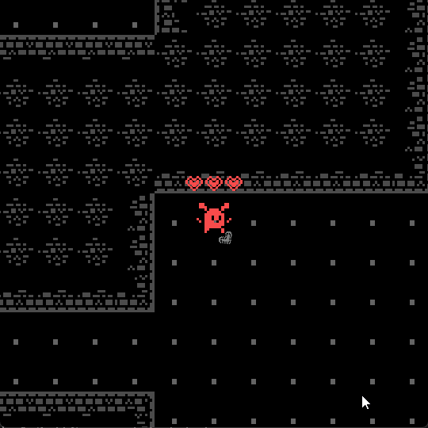
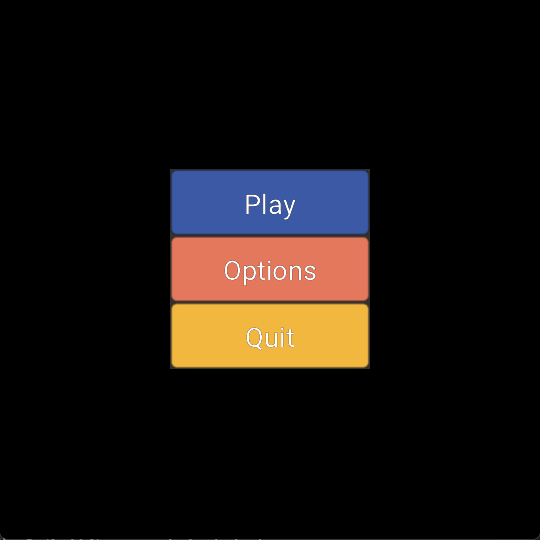

### Description
This is a roguelike game/engine *demo* based on the movie of similar name. </br>
You are the Master of the Flying Kealotine, the most Gruesome weapon ever conceived! </br>
Some [context](https://www.youtube.com/watch?v=RmdP1qTjGZY). </br>
<div style="display: grid; grid-template-columns: repeat(2, 1fr); gap: 0px;">
  
  
  
  
</div>
### How to play
The gameplay loop is killing enemies with the Kealotine. </br>
- Move with WASD. </br>
- Dash with Space. </br>
- Unleash the Kealotine with LMB. </br>
- Activate it with RMB. </br>
### Tech
Engine side, I want things as generic as possible so that I can copy-paste the engine for other projects. </br>
To keep my sanity, currently we do OpenGL for graphics and SDL2 for everything else. </br>
Only dependency other than these is a [gui](https://github.com/eliasvas/gui) library I'm developing separately. </br>
For gameplay stuff I implemented a [bitset-based ECS](https://github.com/SanderMertens/ecs-faq?tab=readme-ov-file#bitset-based-ecs). </br>
### FAQ
- Why make a custom engine
    - because its fun, I love engine-dev.
- Will this be released commercially some day
    - Don't think so.
- What about assets
    - Currently [placeholder art](https://kenney.nl/assets/1-bit-pack) everywhere.
- How do I see the progress
    - Open items are documented [here](Todo.md).


### Platform support
| Windows  | Linux | WASM |
| :-------------: | :-------------: | :-------------: |
| ✅ | ✅ | ✅ |

### Building
#### Linux (Windows is similar)
```sh
sudo apt-get install build-essential libsdl2-dev libsdl2-2.0-0 libasan6 libgles2-mesa-dev -y
git clone https://github.com/eliasvas/motfk
cd engine && git submodule update --init --recursive && mkdir build
cd build && cmake .. && make --build . -j10
```
#### WASM (Emscripten)
```sh
sudo apt-get install build-essential libsdl2-dev libsdl2-2.0-0 libasan6 libgles2-mesa-dev -y
sudo apt install clang emscripten -y
git clone https://github.com/eliasvas/motfk
cd engine && git submodule update --init --recursive && mkdir -p build/web
set EMCC_DEBUG=1
emcmake cmake ../..
cmake --build . -j10
emrun game.html
```